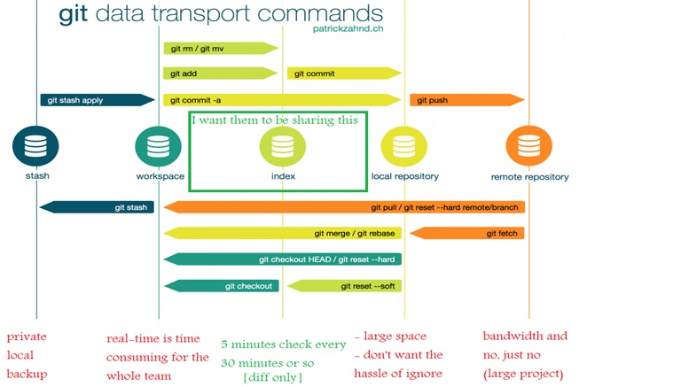
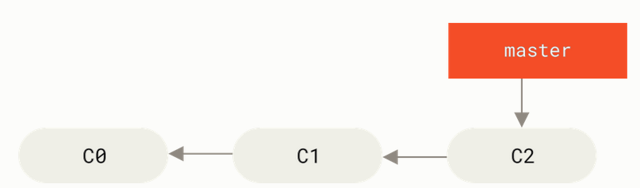
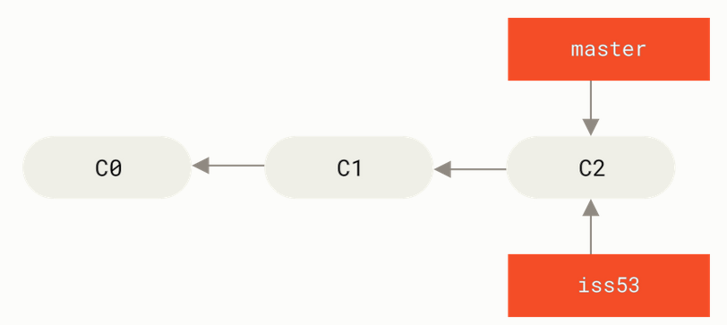
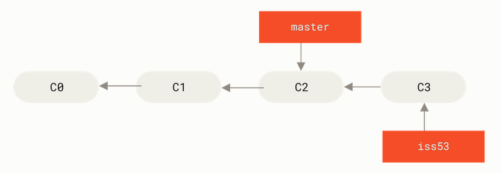
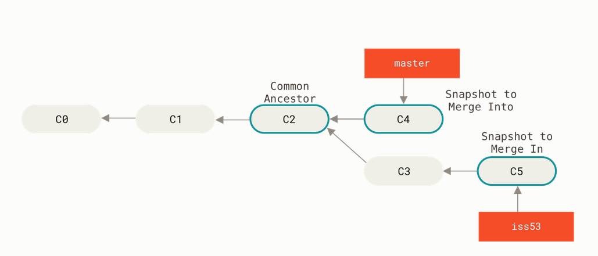
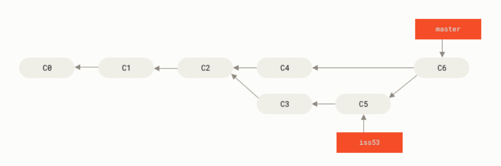

# GIT NOTES

## Introduction:
### What is Git?

Git is a distributed version control system (VCS) used to track changes in source code and collaborate with others.

*In simple terms, Git helps you:*

* Keep a history of your code

* Work on features without breaking the main code

* Collaborate with multiple people safely

* Roll back to earlier versions if something goes wrong

Git was created by Linus Torvalds in 2005 for Linux kernel development.

### How to install GIT :

**Debian/Ubuntu**

For the latest stable version for your release of Debian/Ubuntu
```bash
apt-get install git
```

For Ubuntu, this PPA provides the latest stable upstream Git version

```bash
add-apt-repository ppa:git-core/ppa
apt update
apt install git
```
### Prepartion for Git:

#### first step:
check instalation

```bash
git --version
```
#### second step:

**Set your name and email and DefualtBranch name (must do once)**
```bash
git config --global user.name "Your Name"
git config --global user.email "you@example.com"
git config --global init.defaultBranch main
git config --global pull.rebase "true"
```
Check:
```bash
git config --global --list
```
View all active config (from all levels)
```bash
git config --list
```
**Optional:**
Common Useful Configurations
Default editor
```bash
git config --global core.editor "vim"
```
Enable colored output
```bash
git config --global color.ui auto
```
Default branch name
```bash
git config --global init.defaultBranch main
```

## Getting and Creating Projects:
1. initiate git repository:


git-init - Create an empty Git repository or reinitialize an existing one

```bash
cd /home/user/my_project
git init 
```
2. Clone repository from Github:

 git-clone - Clone a repository into a new directory

 ```bash
 git clone https://github.com/libgit2/libgit2
 ```
## Git Architectures:



**Workflow Steps**
> [!IMPORTANT]
> 1. Local Repository Setup
>    - A developer clones a remote repository (e.g., from GitHub, > GitLab).
>    - This creates three areas locally:
>- Working Directory — where you modify files.
> ```bash
>  vim test.txt
>  touch tets.txt
> ```
> > [NOTE]
>  In this step file move **not staged** status (tracked and not stage):
> For comback file to working directory:
> ```bash
>  git restore test.txt # unchanged file back to working dirctoryfor more edit
> ```
> For move file to **staged** status:
> ```bash
>  git add test.txt 
>  git restore --staged <file> # file back to not stage status
> ```
>- Staging Area (Index) — where you prepare commits.
>```bash
>  git commit -m "message"
>```
> **how to turn back file after comit**
> 1. git reset
>Purpose:
>
>Moves the current branch’s HEAD backward to a previous commit. Depending on the mode, it can affect the staging area and > working directory.
>
>Modes:
>
> **--soft** → Moves HEAD only; keeps changes staged.
> 
> **--mixed (default)** → Moves HEAD and clears the staging area, keeps local changes.
> 
> **--hard** → Moves HEAD and deletes all changes (⚠ irreversible).
> 
>Examples:
>```bash
>git reset --soft HEAD~1   # Undo last commit, keep changes staged
>git reset --hard HEAD~3   # Undo last 3 commits and delete changes
> ```
>- Local Repository (.git) — where commits are stored.
>2. Commit Changes
>    - Files are staged and committed using:
>3. Push (Local → Remote)
>    - Transfers commits from local repository to remote repository:
>```bash
>   git push origin main
>```
>4. Fetch (Remote → Local metadata)
>    - Downloads info about new commits from remote but doesn’t merge:
>```bash
>   git fetch origin
>```
>5. Pull (Remote → Local full sync)
>    - Fetch + Merge together:
>```bash
>   git pull origin main
>```
>6. Branch merges and updates keep repositories synchronized across multiple collaborators.
>
>


 ***Diagram Explanation***
Here’s what the Git data transfer workflow diagram includes:

```
  +-----------------------+
   |      Remote Repo      |
   |   (GitHub / GitLab)   |
   +----------▲------------+
              |
         git push / pull
              |
   +----------▼------------+
   |     Local Repository  |
   |     (.git directory)  |
   +----------▲------------+
              |
       git commit / merge
              |
   +----------▼------------+
   |   Staging Area (Index) |
   +----------▲------------+
              |
           git add
              |
   +----------▼------------+
   |   Working Directory   |
   | (Source Code, Files)  |
   +-----------------------+
```

## Recording Changes to the Repository:
### Checking the Status of Your Files
```bash
$ git status
On branch master
Your branch is up-to-date with 'origin/master'.
nothing to commit, working tree clean

$ echo 'My Project' > README
$ git status
On branch master
Your branch is up-to-date with 'origin/master'.
Untracked files:
  (use "git add <file>..." to include in what will be committed)

    README

nothing added to commit but untracked files present (use "git add" to track)
```
### Tracking New Files:

```bash
$ git add CONTRIBUTING.md
$ git status
On branch master
Your branch is up-to-date with 'origin/master'.
Changes to be committed:
  (use "git reset HEAD <file>..." to unstage)

    new file:   README
    modified:   CONTRIBUTING.md
```
Short Status
```bash
$ git status -s
 M README
MM Rakefile
A  lib/git.rb
M  lib/simplegit.rb
?? LICENSE.txt
```
To see what you’ve changed but not yet staged, type git diff with no other arguments:
```bash
$ git diff
diff --git a/CONTRIBUTING.md b/CONTRIBUTING.md
index 8ebb991..643e24f 100644
--- a/CONTRIBUTING.md
+++ b/CONTRIBUTING.md
@@ -65,7 +65,8 @@ branch directly, things can get messy.
 Please include a nice description of your changes when you submit your PR;
 if we have to read the whole diff to figure out why you're contributing
 in the first place, you're less likely to get feedback and have your change
-merged in.
+merged in. Also, split your changes into comprehensive chunks if your patch is
+longer than a dozen lines.
```
***Ignoring Files***

Often, you’ll have a class of files that you don’t want Git to automatically add or even show you as being untracked. These are generally automatically generated files such as log files or files produced by your build system. In such cases, you can create a file listing patterns to match them named .gitignore. Here is an example .gitignore file:

```bash
$ vim .gitignore

# ignore all .a files
*.a

# but do track lib.a, even though you're ignoring .a files above
!lib.a

# only ignore the TODO file in the current directory, not subdir/TODO
/TODO

# ignore all files in any directory named build
build/

# ignore doc/notes.txt, but not doc/server/arch.txt
doc/*.txt

# ignore all .pdf files in the doc/ directory and any of its subdirectories
doc/**/*.pdf
```
**Removing Files**
```bash
$ rm PROJECTS.md
$ git status
On branch master
Your branch is up-to-date with 'origin/master'.
Changes not staged for commit:
  (use "git add/rm <file>..." to update what will be committed)
  (use "git checkout -- <file>..." to discard changes in working directory)

        deleted:    PROJECTS.md

no changes added to commit (use "git add" and/or "git commit -a")
```
OR

```bash
git rm <file>
git rm -f <file>
```

## Viewing the Commit History
View Commit History:

```bash
$ git log
commit ca82a6dff817ec66f44342007202690a93763949
Author: Scott Chacon <schacon@gee-mail.com>
Date:   Mon Mar 17 21:52:11 2008 -0700

    Change version number

commit 085bb3bcb608e1e8451d4b2432f8ecbe6306e7e7
Author: Scott Chacon <schacon@gee-mail.com>
Date:   Sat Mar 15 16:40:33 2008 -0700

    Remove unnecessary test

commit a11bef06a3f659402fe7563abf99ad00de2209e6
Author: Scott Chacon <schacon@gee-mail.com>
Date:   Sat Mar 15 10:31:28 2008 -0700

    Initial commit
```
 -p or --patch, which shows the difference (the patch output) introduced in each commit

 ```bash
 $ git log -p -2
commit ca82a6dff817ec66f44342007202690a93763949
Author: Scott Chacon <schacon@gee-mail.com>
Date:   Mon Mar 17 21:52:11 2008 -0700

    Change version number

diff --git a/Rakefile b/Rakefile
index a874b73..8f94139 100644
--- a/Rakefile
+++ b/Rakefile
@@ -5,7 +5,7 @@ require 'rake/gempackagetask'
 spec = Gem::Specification.new do |s|
     s.platform  =   Gem::Platform::RUBY
     s.name      =   "simplegit"
-    s.version   =   "0.1.0"
+    s.version   =   "0.1.1"
     s.author    =   "Scott Chacon"
     s.email     =   "schacon@gee-mail.com"
     s.summary   =   "A simple gem for using Git in Ruby code."

commit 085bb3bcb608e1e8451d4b2432f8ecbe6306e7e7
Author: Scott Chacon <schacon@gee-mail.com>
Date:   Sat Mar 15 16:40:33 2008 -0700

    Remove unnecessary test

diff --git a/lib/simplegit.rb b/lib/simplegit.rb
index a0a60ae..47c6340 100644
--- a/lib/simplegit.rb
+++ b/lib/simplegit.rb
@@ -18,8 +18,3 @@ class SimpleGit
     end

 end
-
-if $0 == __FILE__
-  git = SimpleGit.new
-  puts git.show
-end
```
other usefull:
```bash
git log --oneline
git log --oneline --graph
```
## Working with Remotes:
**List remote:**
```bash
$ git clone https://github.com/schacon/ticgit
Cloning into 'ticgit'...
remote: Reusing existing pack: 1857, done.
remote: Total 1857 (delta 0), reused 0 (delta 0)
Receiving objects: 100% (1857/1857), 374.35 KiB | 268.00 KiB/s, done.
Resolving deltas: 100% (772/772), done.
Checking connectivity... done.
$ cd ticgit
$ git remote
origin
```
more detailes:
```bash
$ git remote -v
origin	https://github.com/schacon/ticgit (fetch)
origin	https://github.com/schacon/ticgit (push)
```

**Adding Remote Repositories:**
```bash
git remote add <shortname> <url>

$ git remote
origin
$ git remote add pb https://github.com/paulboone/ticgit
$ git remote -v
origin	https://github.com/schacon/ticgit (fetch)
origin	https://github.com/schacon/ticgit (push)
pb	https://github.com/paulboone/ticgit (fetch)
pb	https://github.com/paulboone/ticgit (push)

Now you can use the string pb on the command line instead of the whole URL. For example, if you want to fetch all the information that Paul has but that you don’t yet have in your repository, you can run git fetch pb

$ git fetch pb
remote: Counting objects: 43, done.
remote: Compressing objects: 100% (36/36), done.
remote: Total 43 (delta 10), reused 31 (delta 5)
Unpacking objects: 100% (43/43), done.
From https://github.com/paulboone/ticgit
 * [new branch]      master     -> pb/master
 * [new branch]      ticgit     -> pb/ticgit
```

> IMPORTANT NOTE
> 
>
>From Git version 2.27 onward, git pull will give a warning if the pull.rebase variable is not set. Git will keep warning you until you set the variable.
>
>If you want the default behavior of Git (fast-forward if possible, else create a merge commit): git config --global pull.rebase "false"
>
>If you want to rebase when pulling: git config --global pull.rebase "true"

Tagging

Like most VCSs, Git has the ability to tag specific points in a repository’s history as being important. Typically, people use this functionality to mark release points (v1.0, v2.0 and so on). In this section, you’ll learn how to list existing tags, how to create and delete tags, and what the different types of tags are.
## Git tagging

- **Listing Your Tags**

```bash
$ git tag
v1.0
v2.0


$ git tag -l "v1.8.5*"
v1.8.5
v1.8.5-rc0
v1.8.5-rc1
v1.8.5-rc2
v1.8.5-rc3
v1.8.5.1
v1.8.5.2
v1.8.5.3
v1.8.5.4
v1.8.5.5
```
- **Creating Tags**

1. Annotated Tags

```bash
$ git tag -a v1.4 -m "my version 1.4" # -m=message
$ git tag
v0.1
v1.3
v1.4
```
---
```bash
$ git show v1.4
tag v1.4
Tagger: Ben Straub <ben@straub.cc>
Date:   Sat May 3 20:19:12 2014 -0700

my version 1.4

commit ca82a6dff817ec66f44342007202690a93763949
Author: Scott Chacon <schacon@gee-mail.com>
Date:   Mon Mar 17 21:52:11 2008 -0700

    Change version number
```
- **Lightweight Tags**

```bash
$ git tag v1.4-lw
$ git tag
v0.1
v1.3
v1.4
v1.4-lw
v1.5
```
---
- **Tagging Later**

```bash
$ git log --pretty=oneline
15027957951b64cf874c3557a0f3547bd83b3ff6 Merge branch 'experiment'
a6b4c97498bd301d84096da251c98a07c7723e65 Create write support
0d52aaab4479697da7686c15f77a3d64d9165190 One more thing
6d52a271eda8725415634dd79daabbc4d9b6008e Merge branch 'experiment'
0b7434d86859cc7b8c3d5e1dddfed66ff742fcbc Add commit function
4682c3261057305bdd616e23b64b0857d832627b Add todo file
166ae0c4d3f420721acbb115cc33848dfcc2121a Create write support
9fceb02d0ae598e95dc970b74767f19372d61af8 Update rakefile
964f16d36dfccde844893cac5b347e7b3d44abbc Commit the todo
8a5cbc430f1a9c3d00faaeffd07798508422908a Update readme


$ git tag -a v1.2 9fceb02
```
## Git Branching

### How to create and change branches:

- Creating a New Branch

```bash
git branch testing
```
This creates a new pointer to the same commit you’re currently on.

see 
```bash
git log --oneline --decorate
```
- Switching Branches

To switch to an existing branch, you run the git checkout command

```bash
git checkout testing
```
for list:
```bash
git log --oneline --decorate --graph --all
```
### Basic Branching and Merging:


Let’s go through a simple example of branching and merging with a workflow that you might use in the real world. You’ll follow these steps:

    Do some work on a website.

    Create a branch for a new user story you’re working on.

    Do some work in that branch.

At this stage, you’ll receive a call that another issue is critical and you need a hotfix. You’ll do the following:

    Switch to your production branch.

    Create a branch to add the hotfix.

    After it’s tested, merge the hotfix branch, and push to production.

    Switch back to your original user story and continue working.

Basic Branching

First, let’s say you’re working on your project and have a couple of commits already on the master branch.




You’ve decided that you’re going to work on issue #53 in whatever issue-tracking system your company uses. To create a new branch and switch to it at the same time, you can run the git checkout command with the -b switch:
```bsh
$ git checkout -b iss53
```
Switched to a new branch "iss53"

This is shorthand for:
```bash
$ git branch iss53
$ git checkout iss53
```




You work on your website and do some commits. Doing so moves the iss53 branch forward, because you have it checked out (that is, your HEAD is pointing to it):
```bash
$ vim index.html
$ git commit -a -m 'Create new footer [issue 53]'
```




Now you get the call that there is an issue with the website, and you need to fix it immediately. With Git, you don’t have to deploy your fix along with the iss53 changes you’ve made, and you don’t have to put a lot of effort into reverting those changes before you can work on applying your fix to what is in production. All you have to do is switch back to your master branch.

However, before you do that, note that if your working directory or staging area has uncommitted changes that conflict with the branch you’re checking out, Git won’t let you switch branches. It’s best to have a clean working state when you switch branches. There are ways to get around this (namely, stashing and commit amending) that we’ll cover later on, in Stashing and Cleaning. For now, let’s assume you’ve committed all your changes, so you can switch back to your master branch:
```bash
$ git checkout master
```
Switched to branch 'master'

At this point, your project working directory is exactly the way it was before you started working on issue #53, and you can concentrate on your hotfix. This is an important point to remember: when you switch branches, Git resets your working directory to look like it did the last time you committed on that branch. It adds, removes, and modifies files automatically to make sure your working copy is what the branch looked like on your last commit to it.

Next, you have a hotfix to make. Let’s create a hotfix branch on which to work until it’s completed:
```bash
$ git checkout -b hotfix
```
Switched to a new branch 'hotfix'
```bash
$ vim index.html
$ git commit -a -m 'Fix broken email address'
[hotfix 1fb7853] Fix broken email address
 1 file changed, 2 insertions(+)
```


You can run your tests, make sure the hotfix is what you want, and finally merge the hotfix branch back into your master branch to deploy to production. You do this with the git merge command:
```bash
$ git checkout master
$ git merge hotfix
Updating f42c576..3a0874c
Fast-forward
 index.html | 2 ++
 1 file changed, 2 insertions(+)
```
You’ll notice the phrase “fast-forward” in that merge. Because the commit C4 pointed to by the branch hotfix you merged in was directly ahead of the commit C2 you’re on, Git simply moves the pointer forward. To phrase that another way, when you try to merge one commit with a commit that can be reached by following the first commit’s history, Git simplifies things by moving the pointer forward because there is no divergent work to merge together — this is called a “fast-forward.”

Your change is now in the snapshot of the commit pointed to by the master branch, and you can deploy the fix.


Figure 21. Hotfix branch based on master

You can run your tests, make sure the hotfix is what you want, and finally merge the hotfix branch back into your master branch to deploy to production. You do this with the git merge command:
```bash
$ git checkout master
$ git merge hotfix
Updating f42c576..3a0874c
Fast-forward
 index.html | 2 ++
 1 file changed, 2 insertions(+)
```
You’ll notice the phrase “fast-forward” in that merge. Because the commit C4 pointed to by the branch hotfix you merged in was directly ahead of the commit C2 you’re on, Git simply moves the pointer forward. To phrase that another way, when you try to merge one commit with a commit that can be reached by following the first commit’s history, Git simplifies things by moving the pointer forward because there is no divergent work to merge together — this is called a “fast-forward.”

Your change is now in the snapshot of the commit pointed to by the master branch, and you can deploy the fix.


After your super-important fix is deployed, you’re ready to switch back to the work you were doing before you were interrupted. However, first you’ll delete the hotfix branch, because you no longer need it — the master branch points at the same place. You can delete it with the -d option to git branch:

$ git branch -d hotfix
Deleted branch hotfix (3a0874c).

Now you can switch back to your work-in-progress branch on issue #53 and continue working on it.
```bash
$ git checkout iss53
Switched to branch "iss53"
$ vim index.html
$ git commit -a -m 'Finish the new footer [issue 53]'
[iss53 ad82d7a] Finish the new footer [issue 53]
1 file changed, 1 insertion(+)
```


Basic Merging

Suppose you’ve decided that your issue #53 work is complete and ready to be merged into your master branch. In order to do that, you’ll merge your iss53 branch into master, much like you merged your hotfix branch earlier. All you have to do is check out the branch you wish to merge into and then run the git merge command:
```bash
$ git checkout master
Switched to branch 'master'
$ git merge iss53
Merge made by the 'recursive' strategy.
index.html |    1 +
1 file changed, 1 insertion(+)
```
This looks a bit different than the hotfix merge you did earlier. In this case, your development history has diverged from some older point. Because the commit on the branch you’re on isn’t a direct ancestor of the branch you’re merging in, Git has to do some work. In this case, Git does a simple three-way merge, using the two snapshots pointed to by the branch tips and the common ancestor of the two.



Figure - Three snapshots used in a typical merge

Instead of just moving the branch pointer forward, Git creates a new snapshot that results from this three-way merge and automatically creates a new commit that points to it. This is referred to as a merge commit, and is special in that it has more than one parent.




